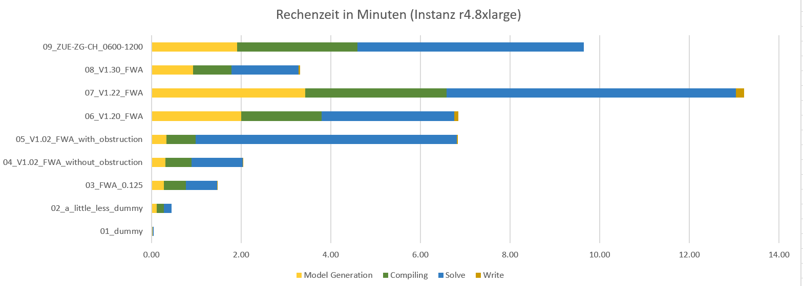

# Code for the Train Schedule Optimisation Challenge
 In this Repository you find my Code that I wrote for the [SBB Train Schedule Optimisation Challenge 2018](https://www.crowdai.org/challenges/train-schedule-optimisation-challenge). Out of 9 Problem instances, this code solves all but the last instance.

## My Solution 
 I ended up with a pipeline controlled by a R program. Along the way the program did the following steps:

1. Read the Source files and simplifies it
2. Build the graph for each route
3. Find the shortest path for each route (wrt the objective function)
4. Output the problem as a Minizinc problem to a file (reduce some statements that can never be true along the way)
5. Call Minizinc to compile the file to Flatzinc (for speed reasons without any optimization)
6. Call the Google OR-Tools Flatzinc-Solver
7. Read the result from the Flatzinc-Solver and create the JSON result file

Step 2 and 3 where parallelized in R. In Step 6 I run the Solver in parallel. All in all, I ended with around 450 Lines of R code.

## Benchmark



## Installation 

To run this code you need a linux with Minizinc 2.2.1 and Google OR-Tools 6.9.1. You can download Minizinc as a binary from https://github.com/MiniZinc/MiniZincIDE/releases/download/2.2.1/MiniZincIDE-2.2.1-bundle-linux-x86_64.tgz .
For the OR-Tools there is currently no binary for this version, so you need to download the code from Github and compile it yourself.

You might need the following packages installed:
```
sudo apt-get update
sudo apt install -y libqt5core5a
sudo apt install -y libqt5printsupport5
sudo apt install -y unzip
sudo apt-get -y install build-essential zlib1g-dev
sudo apt install -y cmake
sudo apt-get -y install swig
sudo apt -y install autoconf
sudo apt install -y r-base
sudo apt install -y r-base-core
sudo apt install pkg-config
sudo apt-get install python-dev
sudo apt install -y python3-pip
python3.6 -m pip install virtualenv
```

The python packages (last 3 lines) are only needed if you want to send the solution to the server.